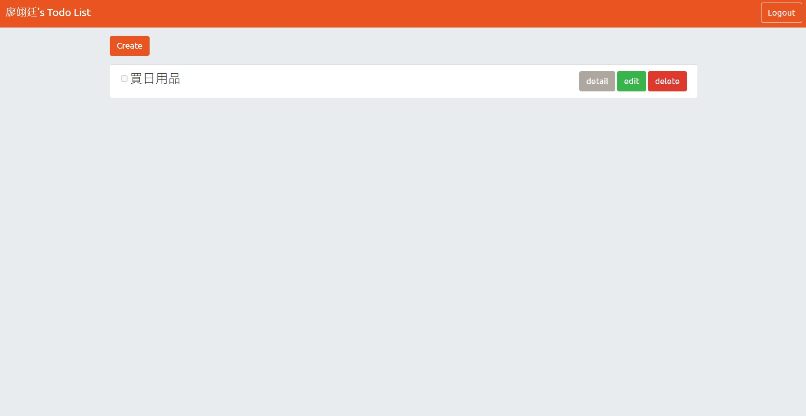
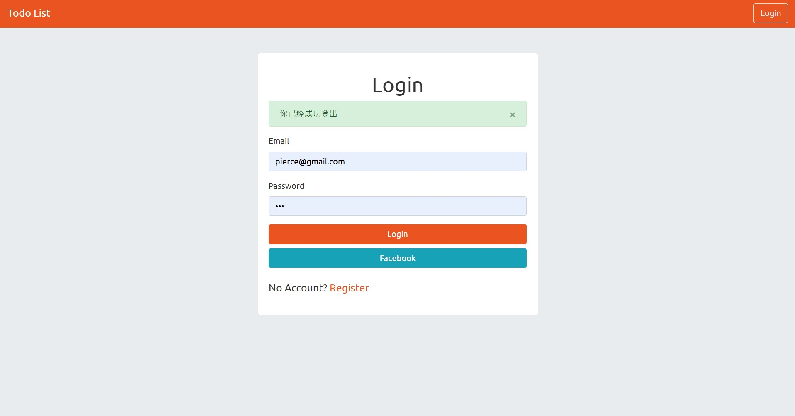
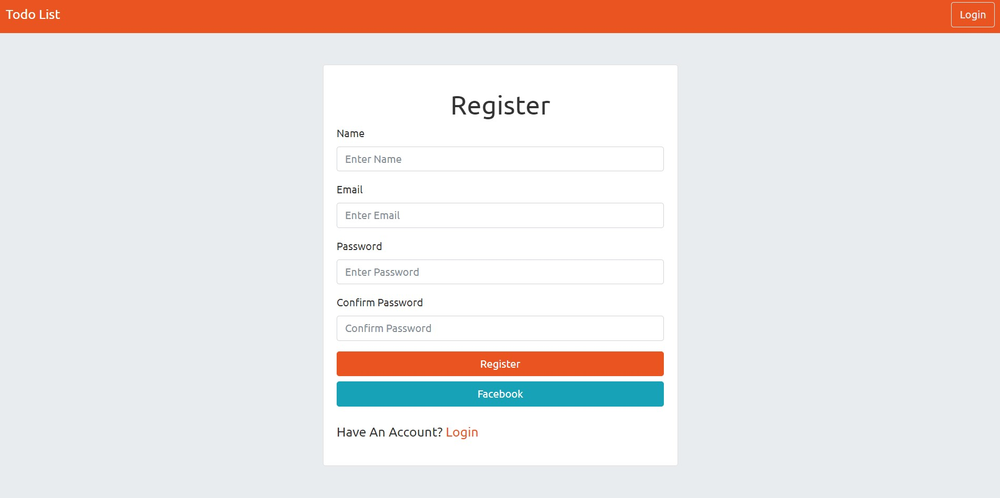

# 備忘錄todo-list
使用Express搭配mySql資料庫製作的備忘錄

## 首頁

## 登入頁

## 註冊頁

## 功能
1. 使用者可以瀏覽所有待辦事項
2. 使用者可以新增待辦事項
3. 使用者可以修改待辦事項
4. 使用者可以刪除待辦事項
5. 使用者可以註冊自己的帳戶並使用email及密碼登入
6. 使用者可以使用facebook登入
7. 使用者可以透過登入建立並管理屬於他的待辦事項列表

## 環境與套件
* 環境：[Node.js](https://nodejs.org/en/)
* 框架：[Express](https://expressjs.com/)
* 樣板：[handlebars](https://www.npmjs.com/package/express-handlebars)
* 套件：[Bootstrap](https://getbootstrap.com/docs/4.6/getting-started/introduction/)
* 套件：[Popper.js](https://popper.js.org/)
* 套件：[Jquery.js(3.6.0.min)](https://jquery.com/)
* 套件：[bcrypt](https://www.npmjs.com/package/bcryptjs)
* 套件：[connect-flash](https://www.npmjs.com/package/connect-flash)
* 套件：[dotenv](https://www.npmjs.com/package/dotenv)
* 套件：[passport](https://www.npmjs.com/package/passport)
* 套件：[passport-local](https://www.npmjs.com/package/passport-local)
* 套件：[passport-facebook](https://www.npmjs.com/package/passport-facebook)
* 套件：[method-override](https://www.npmjs.com/package/method-override)
* 套件：[sequelize](https://www.npmjs.com/package/sequelize)
* 套件：[mysql2](https://www.npmjs.com/package/mysql2)
* 套件：[sequelize-cli](https://www.npmjs.com/package/sequelize-cli)
* 資料庫：[mySql](https://www.mongodb.com/)

## 安裝與執行步驟
1. 使用終端機，clone此專案到local位置

        git clone https://github.com/tim80411/todo-sequelize.git

2. 使用終端機，進入此專案所在的資料夾

        cd todo-sequelize

3. 安裝套件

        npm install
4. 安裝MySql
5. 新增種子資料、資料表

        npx sequelize db:migrate

7. 在資料夾下建立.env檔案並參考.env.example檔案

9.  前往[Facebook](https://developers.facebook.com/)註冊應用程式並獲取passport-facebook需要的 FACEBOOK_APP_ID&FACEBOOK_APP_SECRET

8. 啟動伺服器

        npm run dev

10. 看到以下字樣代表成功啟動並監聽server以及成功連上資料庫

        app is running on http://localhost:3000

        
在任一瀏覽器輸入localhost:3000即可進入網站
